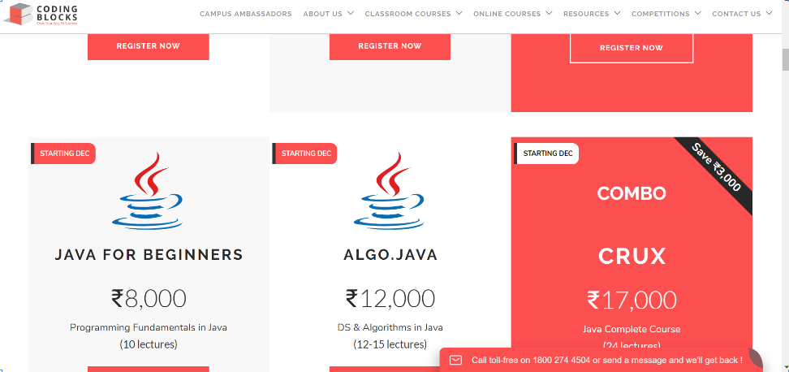
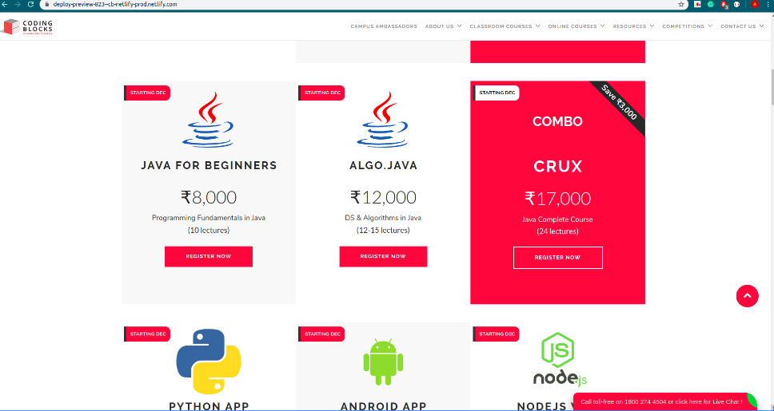

# Software-_Development-Project

Worked as a Design Manager in a Software development team of 10 people.

Used TSP Process Dashboard.

Added a feature to ensure a better user experience on website of Coding blocks(https://codingblocks.com) which is an online teaching community like coursera having more than 10,000 students.

Successfully created a pull request on their github repository with added feature.

### What did I do as Design Manager?

1. Lead the team into producing a Superior and Effective Design.
2. Worked with the Team Lead to get the most complete and clear Requirements Possible.
3. Designed a Process Flow Design
4. Made sure to Design with Implementation, Testing & Quality Managers to make sure it's understood in a clear manner.
5. Completed the Design Documentation.
6. Maintained a focus on Design Issues throughout the process.

### The Design of the Software feature has been documented into 4 Document Forms.

1. Functional Design-  To describe the modular parts of the software.
2. Operational Design- To hold descriptions of the likely operational scenarios followed during program use .
3. Logic Specification- To arrange data into series of logical relationships.
4. State Specification- To describe the state and state transition specifications for a system, class or program

## Before

## After

